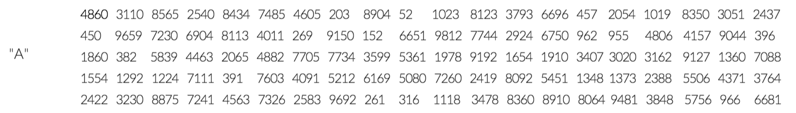
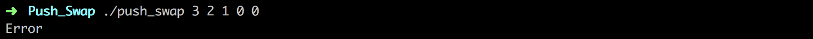
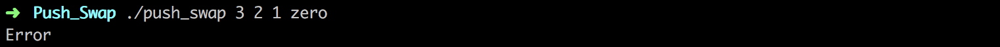
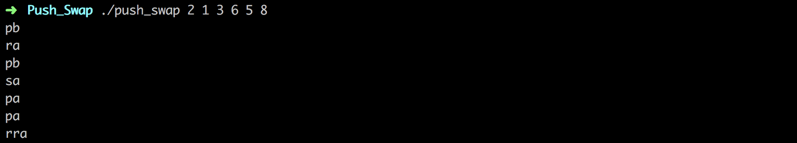
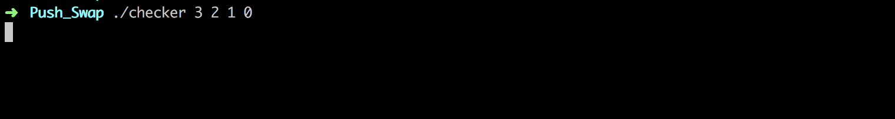
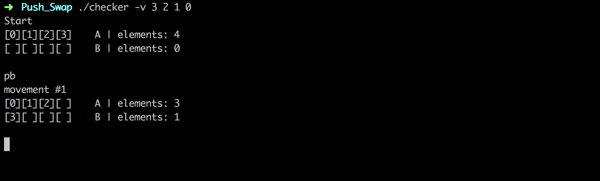

# Push_Swap - 42 School Project 

## Highlights

* This project was about sorting an array of integers using 11 given operations. Each operation is considered as a move, and the idea is to sort the array in the less amount of moves.

* The 11 allowed operations are: sa, sb, ss, ra, rb, rr, rra, rrb, rrr, pa and pb.

* To perform these operations i have two stacks, the first one known as "A" will contain the to-sort array, and the second known as "B" will be an empty stack in wich i was able to push elements from "A" as part of the sorting process.

## My approach for arrays with less than 6 elements

The idea is to create a trie in wich every possible secuence of operations can be executed. This way i'll be sure that i was finding the shortest solution. But the problem was that i was using a lot of memory to perform all the calculations. Even for sorting arrays of 4 elements it was taking a lot of time. So i needed to optimize this method doing the following:

a) Reducing the number of operations from 11 to 8 by checking ss, rr and rrr in a second phase. In that second phase every time i find  a pair of sa-sb or sb-sa i can replace it for ss; the same for rr (ra-rb or rb-ra) and rrr (rra-rrb or rrb-rra).

b) Preventing branches with non-applicable operations (ex: sb, rb, rrb or pa at the beginning).

c) Interrupting some branches from keep growing if the array in it become more unsorted, or don't show a minimum of progress.

The trie is executed level by level and every operation is checked, if at any given point the stack "A" is sorted and the stack "B" is empty, the trie stops, and the according secuence of operations that leaded into this leaf is printed as the solution.
 
 ## The algorithm for arrays with 100 or 500 elements
 
The first step is to copy, from the smaller to the bigger, all the elements of the stack "A" into a new array. We will refer to this array as "guide", it contains a sorted copy of "A".

 

This will allow to divide in groups the stack "A" by using the indexes of "guide". In the case of a 100 elements array, there will be 5 groups of 20 elements each.

A visual representation of the position of every element of every group looks like this:

 
The second step is to move all the elements of the first group from the stack "A" to the stack "B". This is done by moving every time the element wich is the closest to the top of the stack. In other words, the one that needs the less amount of "shifting up" or "shifting down" (ra or rra).

Once the closest is localized and moved to the top of "A", the stack "B" need to be 'prepared' to receive the new element. This will shift up or down the stack "B" (rb or rrb) in order to insert the new element in the correct place. So "B" will always stay sorted from the smaller to the bigger.

After moving all the elements of the first group, then it is the turn for the second group, an so on.
Finally, once the stack "A" is empty, the third step is to move back all the elements from stack "B" to stack "A".

In the case of a stack of 500 elements, there will be 11 groups of 45 elements each.

## Logbook

I recommend to take a look to this videos from CS50:

* [Computational Complexity][computational complexity]
* [Selection Sort][selection sort]
* [Bubble Sort][bubble sort]
* [Insertion Sort][insertion sort]
* [Merge Sort][merge sort]
* [Algorithms Summary][algorithms summary]
* [Stacks][stacks]
* [Tries][tries]

## Installation
At the root of this repository:

`cd push_swap` | Go to the compilation directory.

`make` | Compiles and creates two programs: `push_swap` and `checker`.

## Usage
`./push_swap [integers array]` | Prints the solution.

`./checker [integers array]` | Reads the solution from the standard input, and prints "OK" or "KO".

The `integers array` can be:
- Multiple ints as arguments (3 2 1 0).
- One single char string argument ("3 2 1 0").
- A combination of both (3 "2 1" 0).

## Optional flags
`./push_swap -w [integers array]` | Prints the solution in a file.

`./checker -r [integers array]` | Reads the solution from a file.

`./checker -v [integers array]` | Reads the solution from the standard input and display, at every time, a visual representation of the stacks current status.

## Input & Output

## Final Thoughts
This project was a good opportunity to put in practice different data structures as: stacks, hash tables and tries. Additionally i really enjoyed taking the moment to thing outside the box and looking for optimization and creative solutions.

## Credits
[*Luis Sanchez*][linkedin] 2019, [42 Silicon Valley][42].

[computational complexity]: https://www.youtube.com/watch?v=YoZPTyGL2IQ
[selection sort]: https://www.youtube.com/watch?v=3hH8kTHFw2A
[bubble sort]: https://www.youtube.com/watch?v=RT-hUXUWQ2I
[insertion sort]: https://www.youtube.com/watch?v=O0VbBkUvriI
[merge sort]: https://www.youtube.com/watch?v=Ns7tGNbtvV4
[algorithms summary]: https://www.youtube.com/watch?v=ktWL3nN38ZA
[stacks]: https://www.youtube.com/watch?v=hVsNqhEthOk
[tries]: https://www.youtube.com/watch?v=MC-iQHFdEDI

[linkedin]: https://www.linkedin.com/in/luis-sanchez-13bb3b189/
[42]: http://42.us.org "42 USA"
